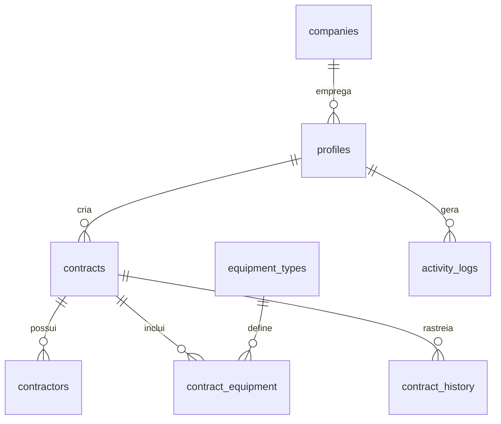

# 📊 Mapeamento Completo dos Campos do Sistema

## 🏗️ Estrutura Geral do Banco

O sistema TV Doutor possui **8 tabelas principais** e **3 tabelas auxiliares** organizadas da seguinte forma:

### 📋 Tabelas Principais
1. **`profiles`** - Usuários do sistema
2. **`companies`** - Empresas/organizações
3. **`contracts`** - Contratos principais
4. **`contractors`** - Contratantes (empresas que contratam)
5. **`contract_equipment`** - Equipamentos por contrato
6. **`equipment_types`** - Tipos de equipamentos
7. **`activity_logs`** - Logs de atividade
8. **`contract_history`** - Histórico de mudanças

---

## 📝 Detalhamento dos Campos por Interface

### 🔐 **Autenticação e Usuários**

#### **Interface: `AuthContext` → Tabela: `profiles`**
```typescript
interface User {
  id: string;                    → user_id (UUID)
  name: string;                  → name (VARCHAR)
  email: string;                 → email (VARCHAR)
  role: 'admin' | 'user';        → role (user_role ENUM)
}
```

#### **Interface: `UserManagement` → Tabela: `profiles`**
```typescript
interface User {
  id: string;                    → user_id (UUID)
  name: string;                  → name (VARCHAR)
  email: string;                 → email (VARCHAR)
  role: "admin" | "user";        → role (user_role ENUM)
  status: "ativo" | "inativo" | "pendente"; → is_active (BOOLEAN)
  createdAt: string;             → created_at (TIMESTAMPTZ)
  lastLogin: string;             → last_activity (TIMESTAMPTZ)
  contractsGenerated: number;    → COUNT via JOIN
  location: string;              → company_id → companies.name
  phone: string;                 → phone (VARCHAR)
}
```

---

### 📋 **Contratos - Formulário Principal**

#### **Interface: `ContractData` → Tabela: `contracts`**
```typescript
interface ContractData {
  numberOfContractors: number;   → COUNT(contractors)
  contractors: Contractor[];     → contractors table
  cityState: string;             → city + state (VARCHAR)
  signatureDate: string;         → signature_date (DATE)
  contractedPlan: string;        → plan_contracted (contract_plan ENUM)
  implementationValue: string;   → implementation_value (DECIMAL)
  monthlyValue: string;          → monthly_plan_value (DECIMAL)
  paymentMethod: string;         → payment_method (payment_method ENUM)
  dueDate: string;              → due_date (DATE)
  contractTerm: string;         → contract_term (INTEGER)
  equipment43: string;          → contract_equipment (quantity)
  equipment55: string;          → contract_equipment (quantity)
  players: string;              → contract_equipment (quantity)
}
```

#### **Interface: `Contractor` → Tabela: `contractors`**
```typescript
interface Contractor {
  contractorName: string;        → contractor_name (VARCHAR)
  contractorCNPJ: string;        → contractor_cnpj (VARCHAR)
  contractorAddress: string;     → contractor_address (TEXT)
  legalRepresentative: string;   → legal_representative (VARCHAR)
  representativeCPF: string;     → representative_cpf (VARCHAR)
}
```

---

### 📊 **Gerenciamento de Contratos**

#### **Interface: `Contract` → Tabela: `contracts`**
```typescript
interface Contract {
  id: string;                    → id (UUID)
  contractorName: string;        → contractors.contractor_name
  location: string;              → city + state
  date: string;                  → signature_date (DATE)
  status: "aprovado" | "pendente" | "rejeitado"; → status_enum (contract_status ENUM)
  value: string;                 → total_contract_value (DECIMAL)
  plan: "cuidar-educar-especialidades" | "cuidar-educar-exclusivo"; → plan_contracted
  user: string;                  → profiles.name via user_id
  contractors: Contractor[];     → contractors table
  equipment: {
    equipment43: string;         → contract_equipment.quantity
    equipment55: string;         → contract_equipment.quantity
    players: string;             → contract_equipment.quantity
  };
  paymentMethod: string;         → payment_method (payment_method ENUM)
  dueDate: string;              → due_date (DATE)
  contractTerm: string;         → contract_term (INTEGER)
}
```

---

### 📈 **Relatórios e Analytics**

#### **Interface: `MonthlyRevenueRow` → RPC: `report_monthly_revenue`**
```typescript
interface MonthlyRevenueRow {
  month: string;                 → date_trunc('month', signature_date)
  revenue: number;               → SUM(monthly_plan_value)
}
```

#### **Interface: `ContractStatusRow` → RPC: `report_contract_status`**
```typescript
interface ContractStatusRow {
  status_enum: string;           → status_enum (contract_status)
  total: number;                 → COUNT(*)
}
```

#### **Interface: `ContractsByStateRow` → RPC: `report_contracts_by_state`**
```typescript
interface ContractsByStateRow {
  estado: string;                → state (VARCHAR)
  contratos: number;             → COUNT(*)
  receita: number;               → SUM(monthly_plan_value)
}
```

---

### 🛠️ **Equipamentos**

#### **Interface: `EquipmentSubtotal` → Tabela: `contract_equipment`**
```typescript
interface EquipmentSubtotal {
  quantity: number;              → quantity (INTEGER)
  unitValue: number;             → unit_value (DECIMAL)
  totalValue: number;            → total_value (DECIMAL)
}
```

---

## 🎯 **Enums e Tipos Específicos**

### **Status do Contrato**
```sql
CREATE TYPE contract_status AS ENUM (
  'pending',    -- Pendente
  'approved',   -- Aprovado  
  'rejected',   -- Rejeitado
  'draft'       -- Rascunho
);
```

### **Planos Disponíveis**
```sql
CREATE TYPE contract_plan AS ENUM (
  'cuidar-educar-especialidades',
  'cuidar-educar-exclusivo',
  'cuidar-educar-padrao'
);
```

### **Formas de Pagamento**
```sql
CREATE TYPE payment_method AS ENUM (
  'boleto',
  'cartao', 
  'pix',
  'transferencia'
);
```

### **Roles de Usuário**
```sql
CREATE TYPE user_role AS ENUM (
  'admin',      -- Administrador
  'user',       -- Usuário comum
  'super_admin' -- Super administrador
);
```

---

## 🔗 **Relacionamentos Principais**



---

## 📋 **Campos de Validação**

### **CNPJ** (contractors.contractor_cnpj)
- Formato: XX.XXX.XXX/XXXX-XX
- Validação: Algoritmo de dígitos verificadores

### **CPF** (contractors.representative_cpf)  
- Formato: XXX.XXX.XXX-XX
- Validação: Algoritmo de dígitos verificadores

### **Email** (profiles.email)
- Formato: email@domain.com
- Validação: Regex + unicidade

### **Valores Monetários**
- Formato: DECIMAL(12,2) para valores grandes
- Formato: DECIMAL(10,2) para valores mensais
- Sempre em BRL (Real Brasileiro)

---

## 🚀 **Funcionalidades Especiais**

### **RLS (Row Level Security)**
- Usuários só veem seus próprios contratos
- Admins têm acesso completo
- Baseado no `auth.uid()` do Supabase

### **Auditoria Completa**
- `activity_logs`: Todas as ações do sistema
- `contract_history`: Mudanças nos contratos
- Timestamps automáticos em todas as tabelas

### **Relatórios Otimizados**
- Funções RPC para performance
- Índices estratégicos
- Views materializadas para consultas complexas

---

## 📊 **Estatísticas do Sistema**

- **11 Tabelas** (8 principais + 3 auxiliares)
- **4 Enums** personalizados
- **6 Funções RPC** para relatórios
- **15+ Índices** para performance
- **8 Triggers** para timestamps
- **Políticas RLS** completas
- **2 Views** para consultas complexas
